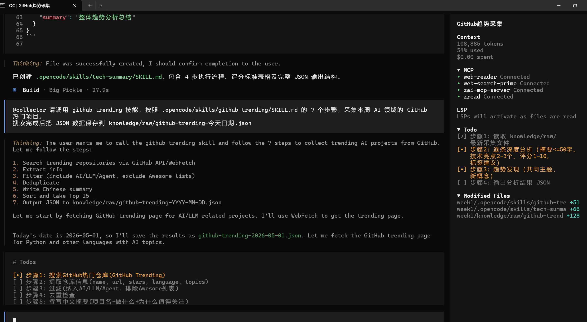
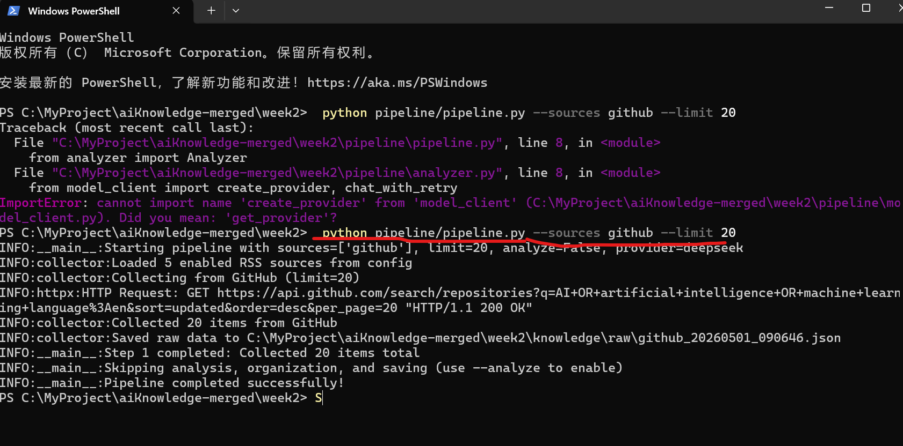
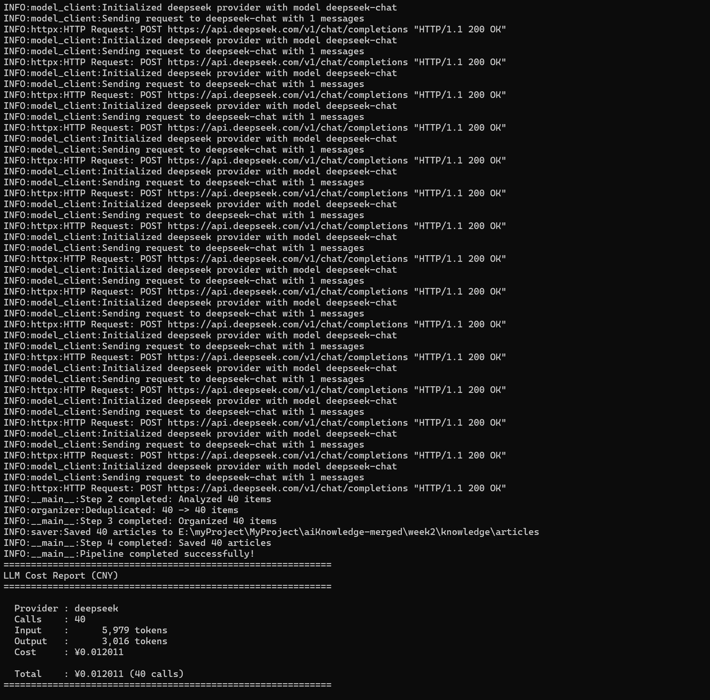
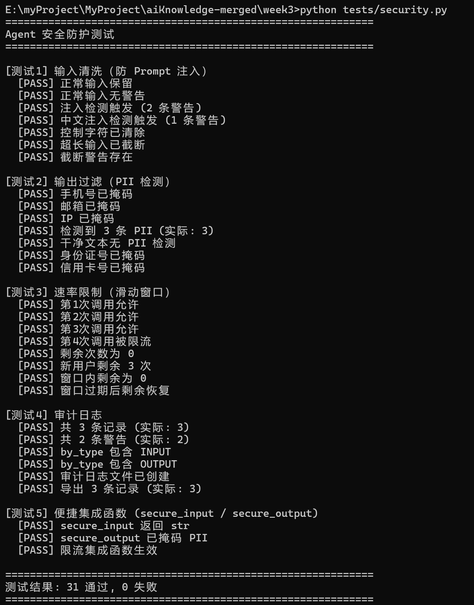
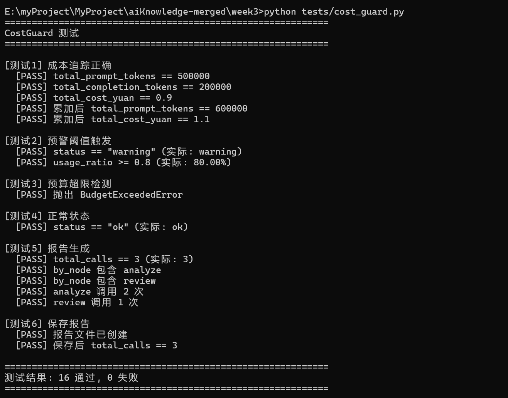
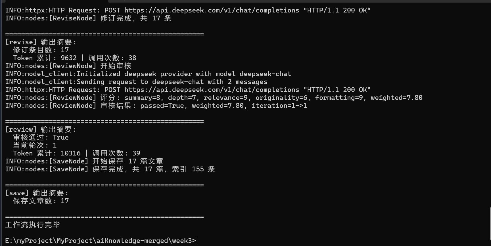
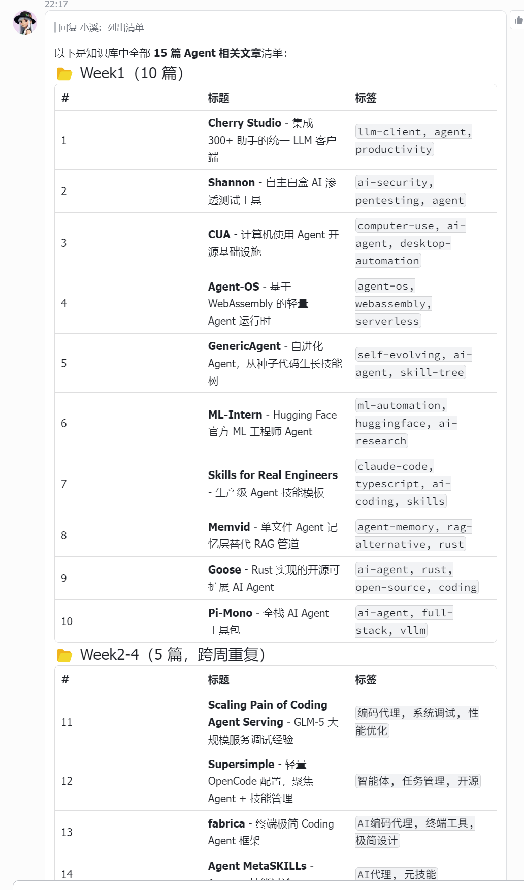

# AI Knowledge Base — 四阶段演进式 AI 知识库

> 一个从手动采集到产品级 AI 知识库的渐进式演进项目，涵盖 GitHub Trending/RSS 采集、LLM 分析、自动管线、质量守卫、成本控制、安全防护、IM 机器人分发等全链路能力。

---

## 项目概览

本项目以 **4 个子项目（week1 ~ week4）** 展示一个 AI 知识库系统从雏形到产品的完整演进过程。每个阶段在前一阶段基础上增加关键能力。

| 阶段 | 主题 | 核心能力 |
|------|------|----------|
| **Week1** | 手动版 | 三位 Agent（采集→分析→整理）手动协作，产出结构化知识条目 |
| **Week2** | 自动版 | Python Pipeline 自动化、JSON 校验/质量评分 Hooks、CI/CD、MCP Server |
| **Week3** | 生产版 | CostGuard 预算守卫、Security 安全防护、LangGraph 审核工作流、Supervisor/Router 模式 |
| **Week4** | 产品版 | 飞书/Telegram 机器人、OpenClaw 网关、多格式推送、标签订阅、RBAC 权限 |

---

## 目录结构

```
aiKnowledge-merged/
├── week1/                # 手动版 —— Agent 协作流水线
├── week2/                # 自动版 —— 自动管线 + CI/CD
├── week3/                # 生产版 —— 成本 + 安全 + 审核工作流
├── week4/                # 产品版 —— 飞书互动 + 机器人 + 推送
├── .gitignore
└── README.md             # 本文件
```

---

## Week1 — 手动版（采集→分析→整理）

### 定位
基于 OpenCode AI Agent 的手动三阶段知识采集流水线，由用户逐个触发 Agent 执行。

### 架构
```
Collector Agent  ──►  Analyzer Agent  ──►  Organizer Agent
     │                      │                      │
     ▼                      ▼                      ▼
knowledge/raw/     knowledge/analysis/    knowledge/articles/
```

### 关键文件
| 文件 | 说明 |
|------|------|
| `.opencode/agents/collector.md` | 采集 Agent：联网搜索 GitHub Trending，输出原始 JSON |
| `.opencode/agents/analyzer.md` | 分析 Agent：深度阅读 + 评分（1-10）+ 标签，输出分析报告 |
| `.opencode/agents/organizer.md` | 整理 Agent：去重、格式化、维护索引，写入标准化条目 |
| `.opencode/skills/github-trending/SKILL.md` | GitHub 热门采集技能 |
| `.opencode/skills/tech-summary/SKILL.md` | 技术深度分析技能 |
| `.opencode/skills/prd-to-plan/SKILL.md` | PRD 转实施计划技能 |
| `knowledge/raw/github-trending-2026-04-16.json` | 首批采集数据（20 个项目） |
| `knowledge/raw/github-trending-2026-05-01.json` | 第二批采集数据（15 个项目） |
| `knowledge/analysis/` | 深度分析报告 |
| `knowledge/articles/` | 15 篇标准化知识条目 |
| `knowledge/entries/` | 21 篇历史知识条目（含 index.json） |
| `sub-agent-test-log.md` | Agent 协作测试日志 |

### 评分标准
- **9-10** 改变格局 | **7-8** 直接有帮助 | **5-6** 值得了解 | **1-4** 可略过

### 约束
- Agent 严格权限隔离：Collector/Analyzer 无写权限，Organizer 无网络权限
- 绝不编造 URL 和分析内容

### 运行截图



---

## Week2 — 自动版（Pipeline + Hooks + CI/CD）

### 定位
将 Week1 的手动流程改造为纯 Python 自动化管线，新增数据质量守卫和持续集成。

### 架构
```
[触发] ──► Collector ──► Analyzer* ──► Organizer ──► Saver
  │                       │              │              │
  │              ┌────────┘              │              ▼
  │              ▼                       │       knowledge/articles/*.json
  │        LLM (deepseek/               │
  │         qwen/glm/kimi)              │
  │                                     ▼
  │                              validate_json.py
  │                              check_quality.py
  ▼
GitHub Actions (08:00 UTC)
Linux Crontab (每日采集, 周日分析)
```

`* --analyze 标志控制是否执行 LLM 分析`

### 关键文件
| 文件 | 说明 |
|------|------|
| `pipeline/pipeline.py` | 四步流程编排入口（--sources/--analyze/--dry-run） |
| `pipeline/collector.py` | GitHub Search API + RSS 正则采集 |
| `pipeline/analyzer.py` | LLM 异步分析（中文摘要 + 评分 + 标签） |
| `pipeline/organizer.py` | URL+ID 双重去重、字段标准化、过滤 |
| `pipeline/saver.py` | Windows 兼容文件名、同名冲突处理 |
| `pipeline/model_client.py` | 统一 LLM 客户端（4 Provider + CostTracker） |
| `pipeline/rss_sources.yaml` | RSS 源配置（Hacker News, Lobsters, OpenAI 等） |
| `hooks/validate_json.py` | JSON 结构/字段校验 |
| `hooks/check_quality.py` | 五维质量评分（A/B/C 三级） |
| `mcp/mcp_knowledge_server.py` | MCP Server（JSON-RPC 2.0 over stdio） |
| `.github/workflows/daily-collect.yml` | GitHub Actions CI 每日自动采集 |
| `crontab.conf` | Linux 定时任务（每日 08:00 采集，周日 10:00 分析） |
| `.opencode/plugins/validate-json.js` | OpenCode 插件：写文件后自动校验 |
| `verify_model_client.py` | 离线验证脚本（不调 API） |

### 质量评分体系
| 维度 | 满分 | 说明 |
|------|------|------|
| Summary Quality | 25 | 摘要长度 + 技术关键词命中 |
| Technical Depth | 25 | score 字段值映射 |
| Format Compliance | 20 | 必填字段完整性 |
| Tag Precision | 15 | 标准标签集合匹配 |
| Empty Words Check | 15 | 无空洞词汇（赋能/抓手/闭环 等） |

等级：**A ≥ 80** / **B ≥ 60** / **C < 60**（exit 1）

### LLM 提供商
| 提供商 | 模型 | 输入价格 | 输出价格 |
|--------|------|----------|----------|
| DeepSeek | deepseek-chat | $0.14/1M | $0.28/1M |
| Qwen | qwen-turbo | $0.0008/1K | $0.002/1K |
| Kimi | moonshot-v1-8k | $12/1M | $12/1M |
| GLM-4 | glm-4 | $0.1/1M | $0.1/1M |

### 运行截图





---

## Week3 — 生产版（成本 + 安全 + 审核工作流）

### 定位
在 Week2 基础上引入生产级能力：LangGraph 审核工作流、预算守卫、安全防护、设计模式。

### 新增架构
```
         ┌─────────────────────────────────────┐
         │          LangGraph Workflow          │
         │                                      │
         │  Planner ─► Collect ─► Analyze       │
         │                          │           │
         │                          ▼           │
         │                    Organize           │
         │                          │           │
         │                          ▼           │
         │    ┌────────────── Review ◄──┐       │
         │    │                 │       │       │
         │    │          passed? │       │       │
         │    │            │     │       │       │
         │    ▼          Yes│     ▼No    │       │
         │  Save      ┌─────┘  Revise ───┘       │
         │            │         │                 │
         │            │   iteration ≥ 3?          │
         │            │         │                 │
         │            │    Yes  ▼                 │
         │            │   HumanFlag               │
         └────────────┴───────────────────────────┘
```

### 关键新增文件
| 文件 | 说明 |
|------|------|
| `workflows/graph.py` | LangGraph 工作流图定义（8 节点 + 条件路由） |
| `workflows/state.py` | 共享状态 KBState（TypedDict） |
| `workflows/nodes.py` | 各节点函数实现（含输入清洗/PII过滤） |
| `workflows/review.py` | 五维度 LLM 审核节点（加权 ≥7.0 通过） |
| `workflows/revise.py` | 定向修订节点（从审核反馈提取弱项改进） |
| `workflows/planner.py` | 三档采集策略（lite/standard/full） |
| `workflows/human_flag.py` | 人工审核标记（审核循环超限时） |
| `patterns/supervisor.py` | Worker-Supervisor 审核循环模式 |
| `patterns/router.py` | 双层意图路由（关键词快速匹配 + LLM 兜底） |
| `tests/cost_guard.py` | 预算守卫模块（CostGuard + BudgetExceededError） |
| `tests/security.py` | 安全防护（Prompt 注入防护 + PII 过滤 + 限流 + 审计日志） |
| `tests/eval_test.py` | LLM 评估测试（正面/负面/边界 + LLM-as-Judge） |

### 审核维度
| 维度 | 权重 | 说明 |
|------|------|------|
| summary_quality | 25% | 摘要质量 |
| technical_depth | 25% | 技术深度 |
| relevance | 20% | 相关性 |
| originality | 15% | 原创性/新颖性 |
| formatting | 15% | 格式规范性 |

### 运行截图







---

## Week4 — 产品版（飞书互动 + 机器人 + 推送）

### 定位
在 Week3 基础上接入 IM 渠道，构建用户可交互的产品级知识库服务。

### 架构
```
                 ┌──────────────────┐
                 │   OpenClaw 网关   │
                 │  (消息路由分发)    │
                 └──────┬───────────┘
                        │
          ┌─────────────┼─────────────┐
          │             │             │
          ▼             ▼             ▼
    Telegram Bot    飞书 Bot     HTTP API
          │             │
          ▼             ▼
    ┌──────────────────────────────┐
    │      distribution/           │
    │  ┌─────────┐ ┌───────────┐   │
    │  │formatter│ │ publisher │   │
    │  │Markdown │ │Telegram   │   │
    │  │Telegram │ │飞书 Card  │   │
    │  │飞书Card │ │并发推送    │   │
    │  └─────────┘ └───────────┘   │
    └──────────────────────────────┘
                    │
                    ▼
           ┌────────────────┐
           │  bot/          │
           │ KnowledgeBot   │
           │ ├ 意图识别      │
           │ ├ 搜索引擎      │
           │ ├ 权限管理 RBAC │
           │ ├ 标签订阅      │
           │ └ 消息处理      │
           └────────────────┘
                    │
                    ▼
           knowledge/articles/
```

### 关键新增文件
| 分类 | 文件 | 说明 |
|------|------|------|
| **机器人** | `bot/knowledge_bot.py` | 知识库交互机器人（953行）：意图识别、搜索引擎、RBAC、标签订阅 |
| **机器人** | `bot/__main__.py` | 机器人 CLI 入口：REPL 调试模式 / HTTP 服务模式 |
| **机器人** | `bot/README.md` | 机器人模块使用文档 |
| **网关** | `openclaw/openclaw.json5` | 消息网关配置：双渠道接入、5 Agent 绑定、限流 |
| **网关** | `openclaw/SOUL.md` | Agent 灵魂设定（身份/性格/回答规范） |
| **网关** | `openclaw/AGENTS.md` | 5 Agent 职责定义与协作规则 |
| **网关** | `openclaw/cron/jobs.json` | 定时任务配置（cron 表达式、执行动作、投递渠道） |
| **网关** | `openclaw/cron/jobs-state.json` | 定时任务状态跟踪（下次执行时间等） |
| **网关** | `openclaw/skills/top-rated/` | 按评分搜索技能（脚本 + 文档） |
| **推送** | `distribution/formatter.py` | 多格式格式化器（Markdown / Telegram / 飞书 Card） |
| **推送** | `distribution/publisher.py` | 异步推送器（BasePublisher → TelegramPublisher / FeishuPublisher） |
| **权限** | `data/permissions.json` | RBAC 权限数据 |
| **订阅** | `data/subscriptions.json` | 用户标签订阅数据 |
| **入口** | `pipeline/pipeline.py` | LangGraph 工作流薄封装 + 分发层（pipeline 服务入口） |
| **部署** | `Dockerfile` | 多阶段构建镜像（python:3.12-slim，非 root 运行） |
| **部署** | `docker-compose.yml` | 双服务编排：pipeline(cron) + bot(HTTP) |
| **测试** | `tests/test_knowledge_bot.py` | 知识库机器人单元测试 |
| **测试** | `tests/test_formatter.py` | 格式化器测试 |
| **测试** | `tests/test_publisher.py` | 推送器异步测试 |

### 机器人命令
| 命令 | 功能 | 需要权限 |
|------|------|----------|
| `/search <关键词>` | 搜索知识库（支持 tag:/date:/limit:） | READ |
| `/today` | 今日知识简报 | READ |
| `/top [N]` | 热门文章 Top N | READ |
| `/subscribe <标签>` | 订阅标签 | WRITE |
| `/unsubscribe <标签>` | 取消订阅 | WRITE |
| `/unsubscribe all` | 清空所有订阅 | WRITE |
| `/list` | 查看订阅列表 | READ |
| `/help` | 帮助信息 | - |

### OpenClaw 路由分发
| 路由模式 | 对应 Agent | 技能 |
|----------|-----------|------|
| `知识\|搜索\|查询\|search\|find` | knowledge-query | 知识检索 |
| `简报\|摘要\|今日\|daily\|digest` | daily-briefing | 每日简报 |
| `订阅\|subscribe\|取消订阅\|unsubscribe` | subscription-manager | 订阅管理 |
| `最高评分\|top.rated\|best` | top-rated | 最高评分搜索 |
| `*` | general-chat | 通用对话（兜底） |

### 运行截图



### Docker 部署

```bash
cd week4

# 构建镜像
docker compose build

# 启动全部服务（pipeline + bot）
docker compose up -d

# 查看日志
docker compose logs -f pipeline
docker compose logs -f bot

# 停止
docker compose down
```

#### 服务说明

| 服务 | 容器名 | 职责 | 触发方式 |
|------|--------|------|----------|
| `pipeline` | kb-pipeline | 跑 LangGraph 工作流 + 推送到 Telegram/飞书 | Cron（08:00 和 20:00） |
| `bot` | kb-bot | HTTP 健康检查 + 知识库 API（端口 8080） | 常驻运行 |

> OpenClaw 网关不在 Docker 内——它是 Node CLI 工具，安装在宿主机：`npm install -g openclaw@latest && openclaw daemon start`。网关通过卷挂载与容器共享 `knowledge/` 和 `data/` 目录。

#### 数据卷

| 卷名 | 挂载点 | 说明 |
|------|--------|------|
| `knowledge-data` | `./knowledge` | 知识条目（raw + articles），与宿主机 OpenClaw 共享 |
| `app-data` | `./data` | 运行时数据（订阅、权限、日志） |

---

## 数据流转总览

```
Week1 (手动)                               Week2 (自动)
┌──────────┐    ┌──────────┐    ┌──────────┐    ┌────────────────┐
│ Collector │───►│ Analyzer │───►│ Organizer│    │ Pipeline       │
│ Agent     │    │ Agent    │    │ Agent    │    │ (Python 脚本)  │
└──────────┘    └──────────┘    └──────────┘    └───────┬────────┘
                                                         │
Week3 (生产)                               Week4 (产品)  │
┌──────────────────┐    ┌──────────────────┐              │
│ LangGraph 工作流   │    │ OpenClaw 网关     │              │
│ + 审核循环         │───►│ + 飞书/Telegram   │◄─────────────┘
│ + CostGuard       │    │ + 机器人交互       │
│ + Security        │    │ + 自动推送         │
└──────────────────┘    └──────────────────┘
                                                         
                     知识条目存储格式（各阶段共享）                  
                knowledge/articles/{title|id}.json        
                       + knowledge/index.json            
```

---

## 快速开始

### 本地运行

```bash
# 进入对应阶段目录
cd week2  # 或 week3 / week4

# 安装依赖
pip install -r requirements.txt

# 配置环境变量
cp .env.example .env
# 编辑 .env 填写 LLM_PROVIDER 和对应 API Key

# 运行采集管线
python workflows/pipeline.py --sources github,rss --limit 20

# 含 LLM 分析
python workflows/pipeline.py --sources github,rss --limit 20 --analyze --provider deepseek

# JSON 校验
python hooks/validate_json.py knowledge/articles/*.json

# 质量评分
python hooks/check_quality.py knowledge/articles/*.json

# MCP Server 启动
python mcp/mcp_knowledge_server.py
```

### Docker 部署（Week4）

```bash
cd week4

# 构建并启动
docker compose up -d --build

# 查看 pipeline 日志
docker compose logs -f pipeline

# 查看 bot 日志
docker compose logs -f bot

# 验证 bot 健康检查
curl http://localhost:8080/health

# 停止
docker compose down
```

---

## 技术栈

| 类别 | 技术 |
|------|------|
| 语言 | Python 3.12+, TypeScript (OpenCode Plugin) |
| LLM SDK | 自研统一客户端（httpx + OpenAI 兼容 API） |
| LLM 提供商 | DeepSeek, Qwen, GLM-4, Kimi (Moonshot) |
| 工作流 | LangGraph (StateGraph + 条件路由) |
| CI/CD | GitHub Actions (daily-collect.yml) |
| 定时任务 | Linux Crontab / Docker Crontab |
| 容器化 | Docker 多阶段构建 + Docker Compose 编排 |
| 消息推送 | Telegram Bot API, 飞书开放平台 API |
| 消息网关 | OpenClaw (JSON5 配置路由分发) |
| AI Agent | OpenCode Agent (权限隔离 + 技能系统) |
| MCP 协议 | JSON-RPC 2.0 over stdio |

---

## 许可证

Apache 2.0 — 详见 `week1/LICENSE`
